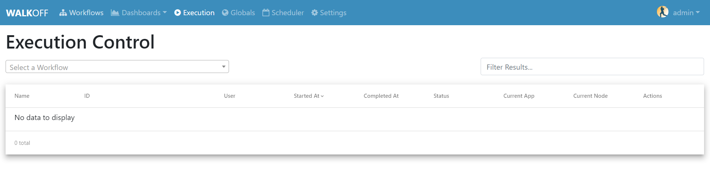
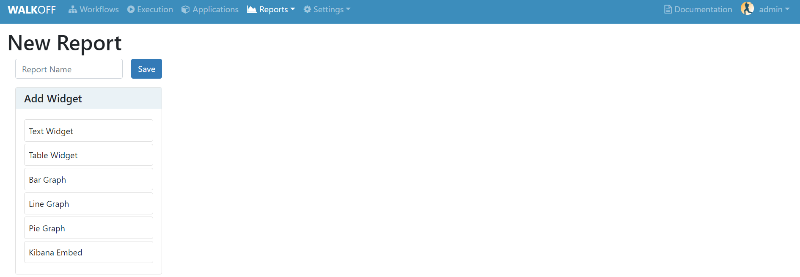
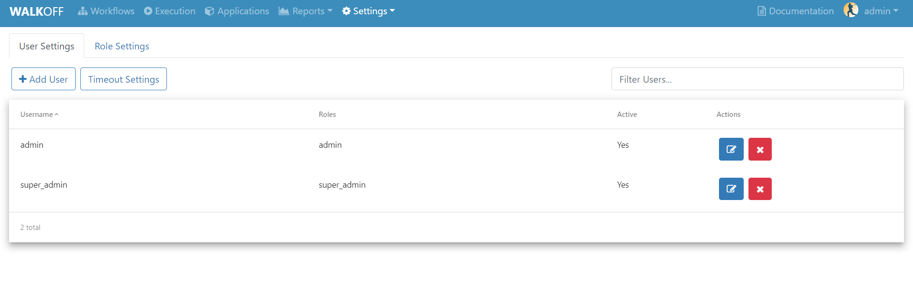
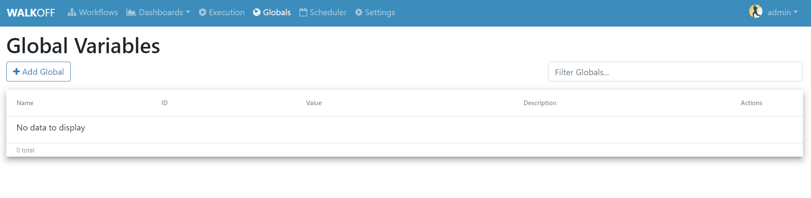
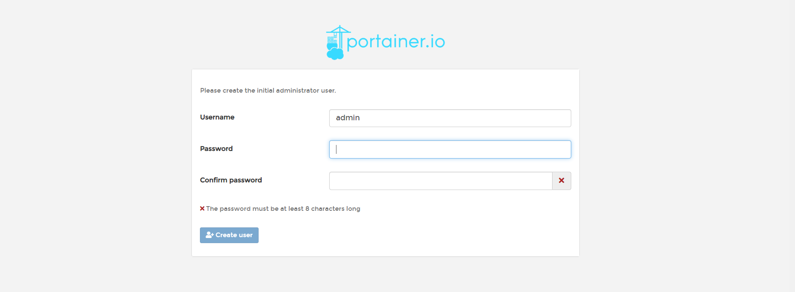
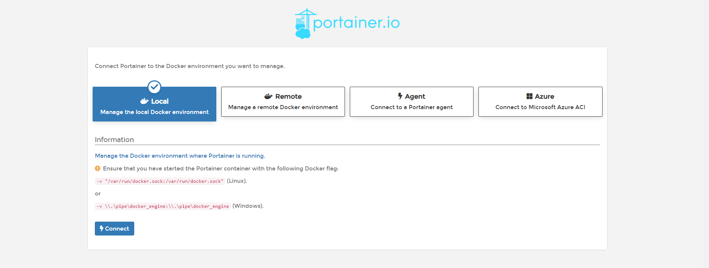
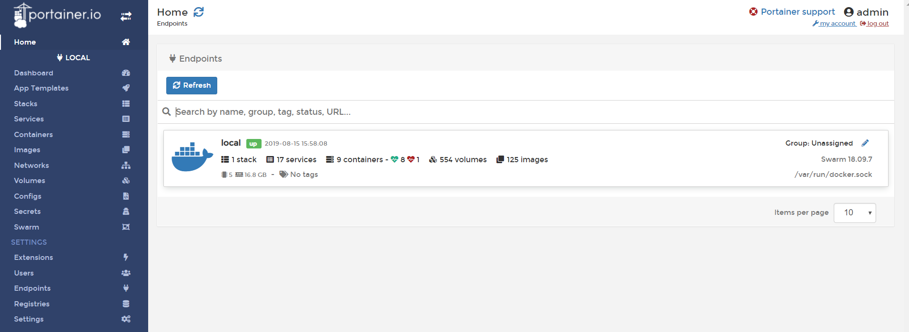

.. _interface:

Interface Overview
========================
In this tutorial, we will briefly cover each of the components of the WALKOFF UI.

Workflows
''''''''''
	Here, you can create or import a WALKOFF workflow. To build your own workflow, click ``Create New``. You can also import and export workflows from this page from/to your local filesystem.

.. image:: ../docs/images/workflows.png

Execution
''''''''''
	Here, you can find the status of Workflows that have begun execution as well as finding the results from said Workflows. You can also choose to abort workflows from this page.

Applications
''''''''''''
	Here you can find all of the apps. It is home to the app editor, in which you can edit and update application images that Walkoff uses to run workflows. Make sure that once you edit and app, you click rebuild to see the changes persist to your local copy of the file.
.. image:: ../docs/images/applications.png
	
Reports
'''''''
	This is the home of custom reports for WALKOFF. These can be used to provide visualizations, telemetry, etc. using results directly from Workflow results. Currently, only CSV output is supported; results being piped to Elasticsearch are in the process of being implemented.

Settings
''''''''
	Here you can find options necessary to make Walkoff more configurable, such as adding Users or global variables. You can also schedule workflow execution through the scheduler or even manage your docker swarm using Portainer. Look below for a description of the features mentioned in this drop-down tab.

Users
~~~~~
	Here you can add users or update role settings/permisions that can lock down access to certain tabs in Walkoff.

Globals
~~~~~~~
	Global Variables can be used to store information such as credentials, configuration, etc. that can be referenced inside workflows. These are stored as encrypted values for security purposes.

Scheduler
~~~~~~~~~
	Here, you can create and configure schedules for running workflows.

.. image:: ../docs/images/scheduler.png

Portainer
~~~~~~~~~
	Portainer is a UI where you can manage your docker swarm allowing you to do things like scaling or viewing logs of specific containers. To navigate here, select portainer.io from the settings drop down menu. It will take you to this page

Make sure to enter a password that is at least 8 characters long. Once you create your password, if prompted with four selection options for the configuration of Portainer, select "Local", then click "Connect"

Once you click "Connect" it should take you to the portainer UI which is linked to our docker swarm. Feel free to look around and check out all of the cool things that portainer has to offer!

