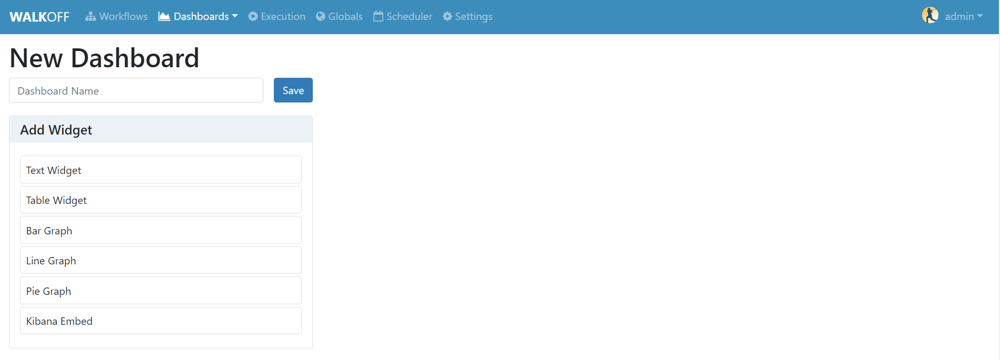
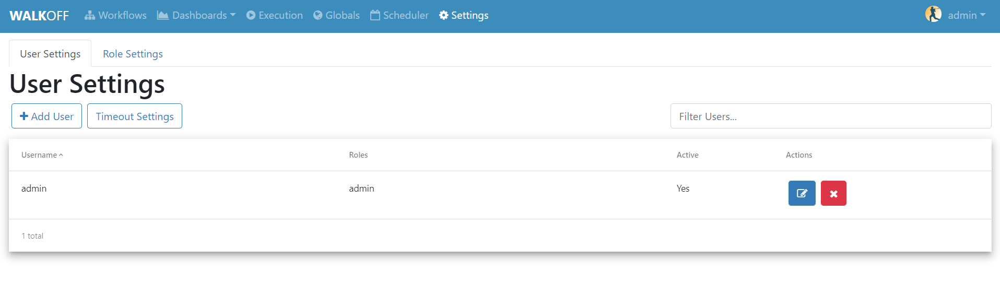

.. _interface:

Interface Overview
========================
In this tutorial, we will briefly cover each of the components of the WALKOFF UI.

Workflows
''''''''''
	Here, you can create or import a WALKOFF workflow. To build your own workflow, click ``Create New``. You can also import and export workflows from this page from/to your local filesystem.

.. image:: ../docs/images/workflows.png

Dashboard
''''''''''
	This is the home of custom dashboards for WALKOFF. These can be used to provide visualizations, telemetry, etc. using results directly from Workflow results. Currently, only CSV output is supported; results being piped to Elasticsearch are being implemented.

Execution
''''''''''
	Here, you can find the status of Workflows that have begun execution as well as finding the results from said Workflows. You can also abort workflows from this page.

.. image:: ../docs/images/execution.png

Globals
''''''''
	Global Variables can be used to store information such as credentials, configuration, etc. that can be referenced inside workflows.

.. image:: ../docs/images/globals.png

Scheduler
''''''''''
	Here, you can create and configure schedules for running workflows.

.. image:: ../docs/images/scheduler.png

Settings
'''''''''
	Here, you can manage your WALKOFF instance and users.

