.. _workflow_dev:

.. |br| raw:: html

   
  
====================
Walkoff Development
====================
In this page we will discuss the workflow editor, how to create a workflow, and the tools available to you.

Workflow Creation
-----------------
In this tutorial, we will create a basic workflow to demonstrate the general features of the workflow editor.

.. _create-global:
Create Global
'''''''''''''
Before we create a workflow, we will create a global variable that our actions will use.

In the top navigation bar, click on ``Settings``, then ``Globals``, then ``Add Global``. Fill out the required fields for this example and set the value to any string of your choice. Here, you may also opt to restrict access to your variable using role-based permissions as described in :ref:`role-user-label`. Then click ``Save`` in the dialog box. If nothing is populated in the globals table, then verify that you created your encryption key as described in :ref:`deploying-walkoff-label`.

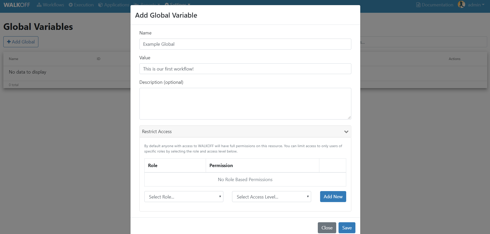

Create Workflow
'''''''''''''''
In the top navigation bar, click ``Workflows`` to return to the main Workflow page. Then, near the top of the page, click the ``Create New`` button. Enter a name for a new workflow (and, optionally, tags and description). Here, you may also opt to restrict access to your variable using role-based permissions as described in :ref:`role-user-label`. Finally, click ``Continue``.

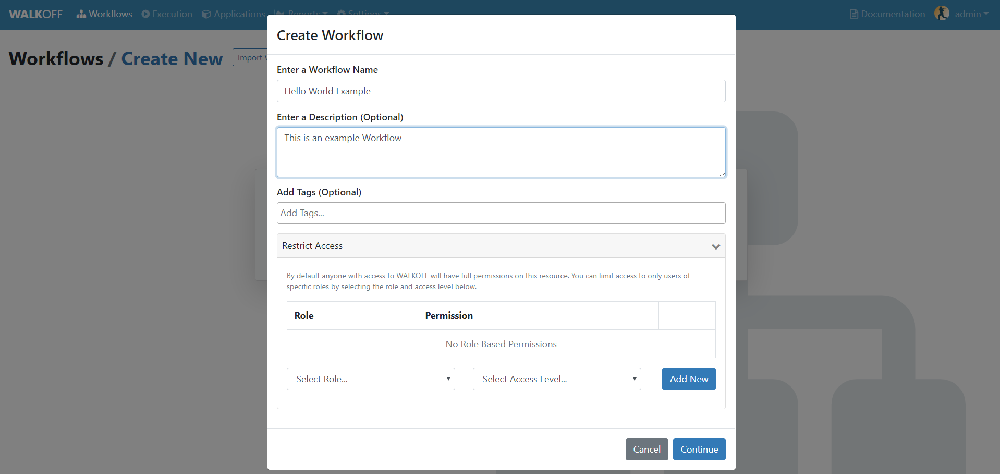

Add Actions to Workspace
''''''''''''''''''''''''
Let's begin by adding a ``hello_world`` action and a ``echo_string`` action from the ``Basics`` app. Expand the ``basics`` app by clicking on the app name in the left pane. Then, double-click, or click and drag the desired actions into the workspace.

Ensure that the ``hello_world`` action is set as the starting node by clicking ``Set as Start Action`` in the Action Parameters pane.

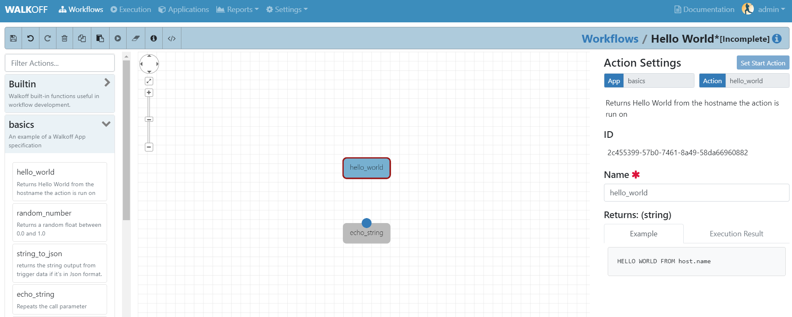

Configure Options
'''''''''''''''''
Some actions will have inputs; some required, some optional. In this case, the ``echo_string`` action has a required parameter, but the ``hello_world`` action does not. Set the ``echo_string`` parameter's type to ``global`` from the drop down and select the global that you created in the previous examples. The action will reference this global to echo the string.

Finally, connect the actions together by clicking and dragging from the top of the hello_world action to the top of the pause action. You can also right-click and drag from one action to the other.

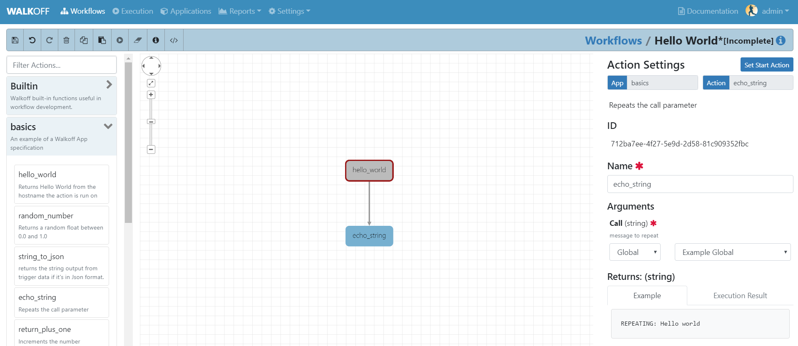

Save and Execute Workflow
'''''''''''''''''''''''''
Using the buttons in the toolbar, save, then execute the workflow. Workflows must be saved before execution in order for the execution to use the current state of the workflow.

Examine Results:
''''''''''''''''
Check the results of your workflow under the ``Execution`` tab below your workflow. These results can also be viewed later under the ``Execution`` tab at the top of the screen. If everything was configured properly, you can expect to see results similar to what is shown below.

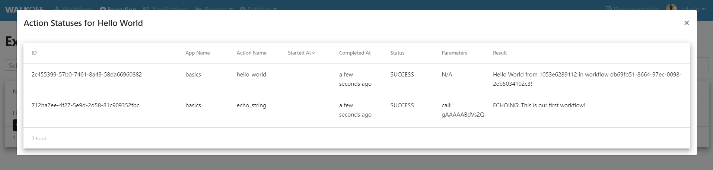

|br|

Workflow Editor
---------------
In this tutorial, we will explore the different components of the Workflow Editor interface.

.. _toolbar-label:

Toolbar
''''''''

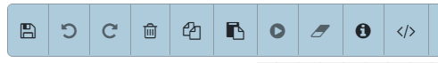

From left to right, the buttons in the toolbar are:

+-----------------------+-----------------------------------------------+
| Save Workflow         | Saves current workflow under specified name   |
+-----------------------+-----------------------------------------------+
| Undo	       	        | Reverts the most recent change in the editor  |
+-----------------------+-----------------------------------------------+
| Redo	       	        | Reapplies the most recent undone action       |
+-----------------------+-----------------------------------------------+
| Delete Selected Nodes	| Deletes the selected Node or Branch           |
+-----------------------+-----------------------------------------------+
| Copy		        | Copies the selected Node                      |
+-----------------------+-----------------------------------------------+
| Paste		        | Pastes the previously copied or cut Node      |
+-----------------------+-----------------------------------------------+
| Execute Workflow      | Schedules the Workflow for execution          |
+-----------------------+-----------------------------------------------+
| Clear Execution    	| Clears highlighting and results of 	        |
| Results	        | executed nodes 			        |
+-----------------------+-----------------------------------------------+
| Edit Description	| Edit the description of the current workflow	|
+-----------------------+-----------------------------------------------+
| Create Variable	| Create and edit workflow-scoped variables     |
+-----------------------+-----------------------------------------------+

Highlighting
''''''''''''
Selected Nodes or Edges will be highlighted in blue. During execution, Nodes that have been scheduled for execution will turn yellow. If they execute successfully, they will turn green; if not, they will turn red.

Apps and Actions
''''''''''''''''
Apps and Actions that you have installed in your Walkoff instance will appear in the left pane. Click the name of an App to reveal the Actions that the App provides (an App is simply a way for us to group associated Actions). To use an Action from the pane, double click on the name of the Action or click and drag the Action into the workspace.

Navigating Workspace
''''''''''''''''''''
The workspace can be navigated using the buttons in the top left of the pane. From top to bottom, these buttons can be used to pan, zoom to fit, or zoom in and out. You can also click and drag on an empty area to pan, and use the scroll wheel on your mouse to zoom in and out.

Connecting Actions Together
'''''''''''''''''''''''''''
When hovering over the top edge of a node, a dot will appear. To create an edge from one node to the next, click and drag from that b dot to the next action in the sequence; an arrow will appear, linking the actions together and creating a branch. A node can point to more than one node; they will all execute unless not chosen by a condition.

Branch Configuration
''''''''''''''''''''
When an action is connected to more than one subsequent action, all of those actions will be scheduled. However as actions execute asynchronously, the order in which those actions execute is not guaranteed. If order is important, assign them sequentially.

Editing Actions
'''''''''''''''
When an Action is selected, its properties will appear in the right pane. These include the App it came from, the Action it will perform, and the Name of the Action (separate from its unique ID). You can also set the starting Action of the Workflow in this pane.

|br|

App Editor
----------
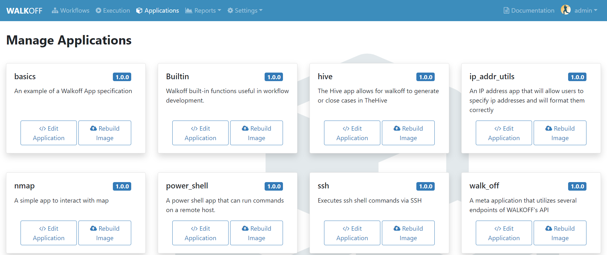

If you navigate to the Applications tab at the top toolbar of Walkoff you will be directed to a page in which you can manage applications. If you click on the button named Edit Application on the desired app you wish to edit, it will take you to a new page that will contain the file tree on the left side of the page. At this point, you can click app.py and the file contents will be displayed on the right as seen below.

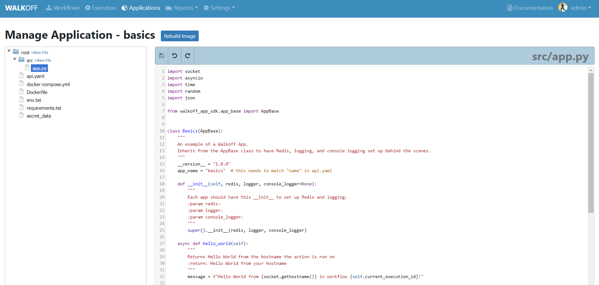

If you want to make edits to any file, you can do that in the file editor that is displayed above. If you would like, you can make changes to multiple files, just make sure to hit the save icon before navigating away from the page. This will save the current file to minio. At this point, minio is prepared to build using the newly saved files. Once you click the "Rebuild Image" button, WALKOFF will pull what is in Minio and rebuild the images based off of those files. Once a successful image is built, Walkoff will copy the files from Minio into your working directory such that those file changes are visible locally. 

*NOTE: You can undo and redo changes made in the app editor using the symbols next to the save button*

|br|

.. _role-user-label:

User and Role Creation
-----------------------
WALKOFF allows for role-based user creation. By default, WALKOFF has four pre-built roles: ``super_admin``, ``admin``, ``workflow_developer``, and ``workflow_operator``. 
	* The ``super_admin`` role is a singular immutable account.  This role has the ability to delete/create new users and is given full access to  all resources created by any user on WALKOFF. Newly created users cannot be given this role; this account cannot be deleted and its role cannot be changed.
	* The ``admin`` role by default is given the same control over WALKOFF as the ``super_admin`` role. However, newly created users can be given this role, and this role may be edited. Furthermore, other users with differing roles may hide workflows and global variables from this role tier.
	* The ``workflow_developer`` role is given the ability to create, update, and delete workflows, global_variables, workflow_variables, dashboards, and schedules. This role does not have the ability to change WALKOFF settings, add new users or roles. 
	* The ``workflow_operator`` role by default is only given the ability to read all WALKOFF resources aside from workflow_variables, which they may update and utilize. They also have the ability to execute workflows that they have access to.

Creating a User
'''''''''''''''''
In order to create a new user, you must be logged in as a user with user creation permission (by default, this permission is given to admin level and above roles).
	* First, navigate to the ``settings`` tab on the WALKOFF toolbar and click on ``users``.
	
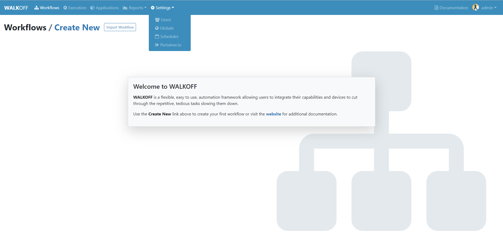

* From this page, click on the ``create user`` button. Fill in the desired username, password, and role tier for this account and click ``Add User`` to complete your user creation.
	
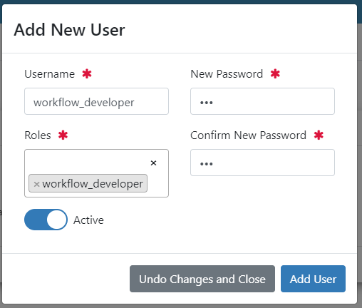

Creating a Role
'''''''''''''''''
In order to create a new user, you must be logged in as a user with role creation permission (by default, this permission is given to admin level and above roles).
	* First, navigate to the ``settings`` tab on the WALKOFF toolbar and click on ``users``.
	

* From this page, click on the ``role settings`` tab.
	

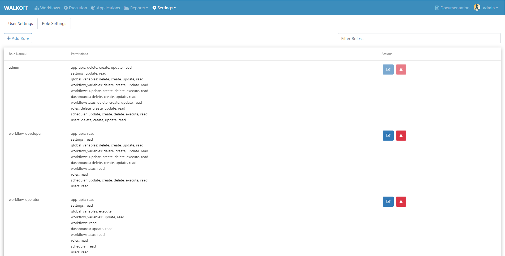

* Fill in the desired role name and optional description.

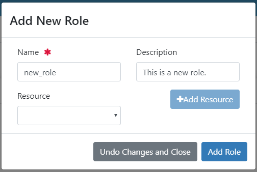

* Select the resource(s) to which you would like to give this role access. After selecting, click ``Add Resource``. Then, select which specific permissions you would like to add. 
	
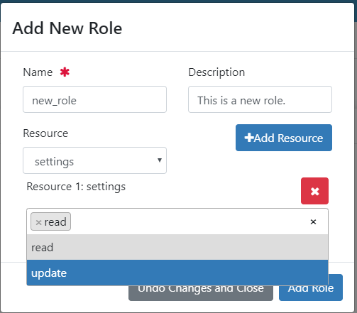

* After resource selection, click ``Add Role`` to complete your role creation. 

|br|

Parameter Passing and Node Types (Builtin)
------------------------------------------
Actions may have parameters, whose properties are defined by the App's ``api.yaml``. By default, a parameter's value is a static value that you specify in the workflow editor. To use the output from an Action as the parameter value for another Action, select ``Action Output`` for the parameter, then select the action you wish to receive the output from. The source action must be a predecessor at some level to the destination action.

Parameter Passing
'''''''''''''''''
There are four different types of parameters you can pass to an action: Static Value, Action Output, Global Variable, and Workflow Variable.

Static Value
~~~~~~~~~~~~
Static Value parameters are those that are set at workflow creation time. In this case, simply supply the value you would like to use.

Action Output
~~~~~~~~~~~~~
Using Action Output allows you to use the output from a previous node as an input parameter to a later node. If an action relies on the output of a previous action, this is the appropriate method to use.

Global Variable
~~~~~~~~~~~~~~~
As the name implies, a Global Variable can be used by any workflow in Walkoff. These are set at :ref:`create-global` and are encrypted by default for storage and are decrypted at action execution time. These can be useful for storing values like credentials or API tokens for use across multiple workflows.

Workflow Variable
~~~~~~~~~~~~~~~~~
Similar to Global Variables, but scoped only to the current workflow. Create a workflow variable using the Create Variable button found in the :ref:`toolbar-label`. These are not encrypted, and are stored within the workflow itself, which means they persist when the workflow is exported.

Node Types
''''''''''

Trigger
~~~~~~~
Workflow execution can be paused by Triggers. To use one, select the ``Builtin`` app in the app bar. Double click or drag the ``Trigger`` action to the workflow space. Connect the Trigger as you would any other action. When execution reaches a trigger, it will pause. To resume execution, send a PATCH to /api/workflowqueue/<execution_id> following the format given in the :ref:`api_gateway` documentation.

Condition
~~~~~~~~~
Conditions are used to select one (or no) branch from many to execute based on the output of its parent node. Conditions are written using simple python:

	.. code-block:: console

		if previous_node.result.get('value') == 0:
			selected_node = blue_node
		elif previous_node.result.get('value') == 1:
			selected_node = red_node

	Refer to nodes by their label, replacing spaces with underscores. Access their results by using `<node_label>.result`. You must then assign `selected_node` to the label of one of the nodes directly following the condition.

    A graphical editor for this will be added at a later date.

Parallel Action
~~~~~~~~~~~~~~~
A special case for Actions, which allows you to run many copies of it in parallel by splitting one of its parameters. For instance, running one copy of an action for each IP in a list of IPs, instead of one action that will iterate over that list. These are denoted by an option called ``Run in Parallel`` located in the parameters panel at the bottom, which is used to select the parameter to parallelize on. Depending on the implementation of the action, this could result in improvements in execution time.
